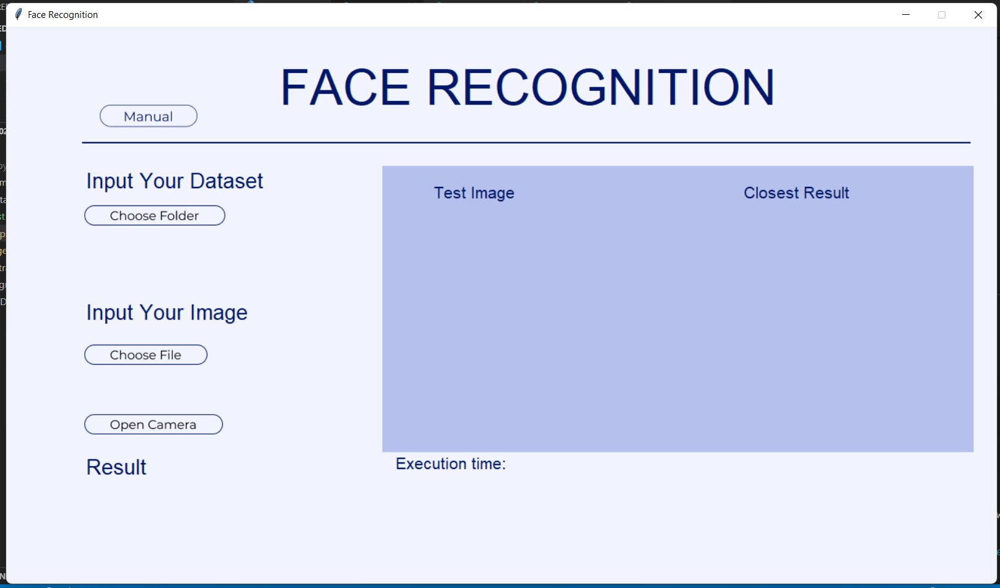

# Algeo02-21075

Face Recognition Application using Eigen Value and Face with QR decomposition

| NIM  | Nama |
| ------------- | ------------- |
| 13521075 | Muhammad Rifko Favian  |
| 13521120  | Febryan Arota Hia  |
| 13521132 | Dhanika Novlisariyanti  |

## Technology Stack Used
1. Python -- 3.11.0
2. Tkinter -- 8.6
2. OpenCV -- 4.6.0
3. Pillow -- 9.3.0
4. Numpy -- 1.21.5
5. Sympy -- 1.11.1

## Screenshot App

## Structures

## How to Run
1. Make sure to have installed all needed library
2. Go to src directory
3. Run `python app.py`

